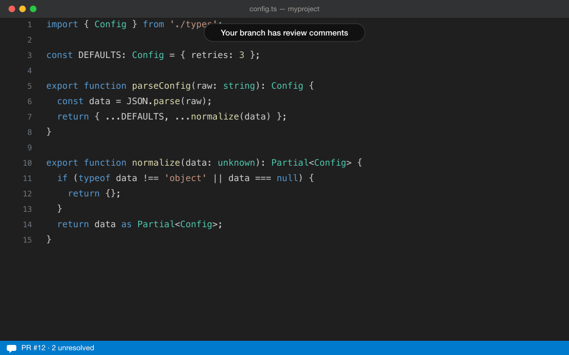

# PTAL

> **P**lease **T**ake **A**nother **L**ook — the thing you say after handling every review comment. This extension gets you there without leaving your code.



## Why

You work in your terminal and VS Code. But the moment you open a PR, you're forced onto the GitHub web UI — where review comments are pinned to diff snippets, there's no go-to-definition, and finding the function a comment refers to means scrolling and guessing.

VS Code is great at exactly that: jumping to definitions, tracing code across files. It just can't show your PR review comments. PTAL fixes that.

**The official GitHub Pull Requests extension removes the browser. PTAL removes the context switch.** The official extension shows comments frozen at review time; PTAL follows your code as it changes — which is exactly when you need it, because changing the code is what handling a review means.

## What it does

Open a branch that has an open PR, and:

- **Review comments appear inline, on the right line of your working tree** — remapped through diff arithmetic even after you push more commits, rebase, or edit locally. Multi-line review ranges are shown in full, with a subtle highlight on unresolved lines.
- **When you fix the commented code, the comment follows the fix** — anchored to the replacement code with an `approximate position` badge instead of getting lost.
- **Reply and resolve/unresolve without opening a browser** — right inside the thread, with no flicker. A failed reply copies your draft to the clipboard; your text is never lost.
- **Jump through unresolved comments** — click the status bar counter (`PR #42: 5/7`) or run `PTAL: Go to Next Unresolved Comment`.
- **It never silently points at the wrong line.** When a position can't be trusted, PTAL says so — `outdated`, `approximate`, `matched by content`, or an honest `position unknown` with the review-time snippet and a link to the comment on GitHub. If your checkout is behind the PR head, the status bar tells you to pull.
- **Zero configuration.** Sign in once via VS Code's built-in GitHub auth. Branch switches are detected automatically. One GraphQL query per refresh — no API hammering.

## Commands

| Command | What it does |
|---|---|
| `PTAL: Refresh Review Comments` | Re-fetch the PR and remap all threads |
| `PTAL: Go to Next Unresolved Comment` | Cycle through unresolved threads (also: click the status bar) |

Reply and Resolve/Unresolve live on the comment threads themselves.

> **Tip:** the built-in **Comments** panel lists every thread across files — your review inbox. Drag it into the sidebar once (right-click its tab → Move View) and it stays there, right next to your code. The default bottom position competes with the terminal; the sidebar is where it shines.

## Status

**v1 complete, in daily dogfooding — not yet on the marketplace.** Works with github.com repositories, built for the PR author handling received reviews. Planned work is tracked in the [issues](https://github.com/jihwanK/ptal/issues).

To try it now:

```bash
git clone https://github.com/jihwanK/ptal && cd ptal
npm install && npx @vscode/vsce package
code --install-extension ptal-*.vsix
```

## License

MIT
